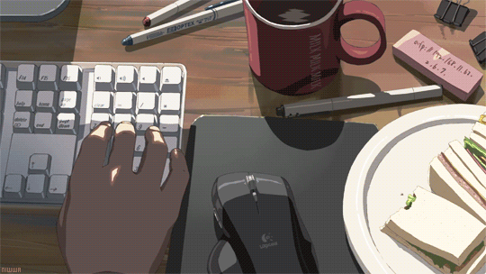

<pre>
┌─────▰▰▰ I keep typing stuff and it keeps working!✨
| 
├─▣ Socials stuff:
|
├─◈🌐 <a href="http://stronk-me.vercel.app">Website</a>
├─◈✖️ <a href="https://twitter.com/_stronkest">Twitter</a>
├─◈👥 <a href="https://www.linkedin.com/in/abderrahman-el-asri">LinkedIn</a>
├─◈👾 Discord: _stronkest
|─◈🥇 Problem Solving platforms:   
|
└─────────────────────────────────────────────────────────▰▰▰
</pre>
 

 

	

